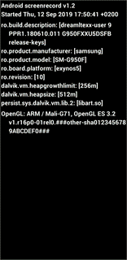

 
# ParallaxScrollingView            

Parallax Scrolling View.

- automatic scrolling with different speeds
- minimal integration
- gpu accelerated
- supports ViewPager2
- argb interpolated gradient on viewpager scrolling
- updates statusBar color on scroll

### How to use

1 add ParallaxScrollingView to your layout

    <net.kibotu.parallaxscrollingview.ParallaxScrollingView
        android:id="@+id/wave1"
        android:layout_width="0dp"
        android:layout_height="wrap_content"
        app:layout_constraintBottom_toBottomOf="parent"
        app:layout_constraintEnd_toEndOf="parent"
        app:layout_constraintStart_toStartOf="parent"
        app:speed="@dimen/wave1_speed"
        app:src="@drawable/ic_wave" />

2 (Optional) add ParallaxScrollingViewOnPageScrollListener to ViewPager2

    viewPager.registerOnPageChangeCallback(ParallaxScrollingViewOnPageScrollListener(listOf(wave1, wave2, wave3, wave4, wave5, wave6), 2f))

3(Optional) add OffsetOnPageScrollListener to ViewPager2

    viewPager.registerOnPageChangeCallback(OffsetOnPageScrollListener(this, root, items.indices.map { backgrounds[it] }, true))

### How to install

	repositories {
	    maven {
	        url "https://jitpack.io"
	    }
	}

	dependencies {
        implementation 'com.github.kibotu:ParallaxScrollingView:-SNAPSHOT'
    }

### License
<pre>
Copyright 2019 Jan Rabe

Licensed under the Apache License, Version 2.0 (the "License");
you may not use this file except in compliance with the License.
You may obtain a copy of the License at

   http://www.apache.org/licenses/LICENSE-2.0

Unless required by applicable law or agreed to in writing, software
distributed under the License is distributed on an "AS IS" BASIS,
WITHOUT WARRANTIES OR CONDITIONS OF ANY KIND, either express or implied.
See the License for the specific language governing permissions and
limitations under the License.
</pre>
